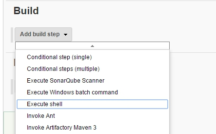
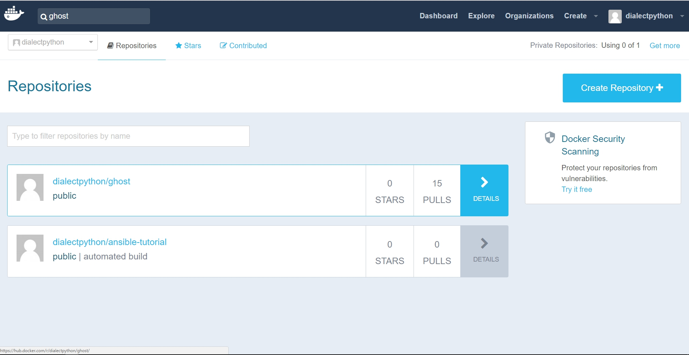
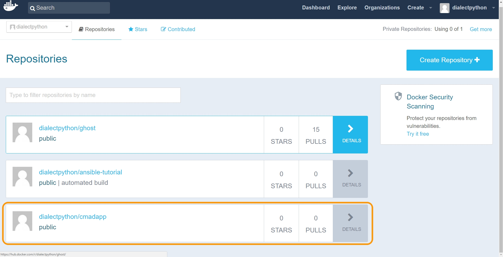

# Create a custom Tomcat image with our application

## Create the Docker job

* Create a freestyle project with the name Docker(or whatever name you wish).
* Give a description and Add **Deploy** project as build trigger.
* You can skip other steps in between.
* In Build(Add build step), select **Execute shell**.



* Paste the following script in the text box.

```
#!/bin/bash

# Version 2

#Define your variable values
jobname=Deploy
jenkinsurl=192.168.0.62:8080
appname=CMADSession
version=0.0.12-\SNAPSHOT
context=cmad
imgname=customtom

#Remove Existing residue files
rm -rf $JENKINS_HOME/Docker

#Prepare the environment
mkdir $JENKINS_HOME/Docker && \
cd $JENKINS_HOME/Docker && \
wget http://$jenkinsurl/job/$jobname/lastSuccessfulBuild/$appname\$$appname/artifact/$appname/$appname/$version/$appname-$version.war && \
mv $appname-$version.war $context.war

#Create Dockerfile
echo "FROM tomcat:latest
ENV CATALINA_HOME /usr/local/tomcat
ENV PATH \$CATALINA_HOME/bin:\$PATH
WORKDIR \$CATALINA_HOME
ADD $context.war /usr/local/tomcat/webapps/
EXPOSE 8080
CMD [\"catalina.sh\", \"run\"]" > Dockerfile

#Create cutom tomcat image
docker build -t $imgname .
```

* Replace the default variable values with your respective values.

* This script will build an custom Tomcat image with your application

* Run *docker images* to see if your image is in your machine or not.

```
REPOSITORY                                TAG                 IMAGE ID            CREATED             SIZE
customtom                                 latest              73af4f86b295        40 minutes ago      355 MB
schoolofdevops/jenkins-2.19.4-alpine      latest              ce303bab6505        2 days ago          340 MB
tomcat                                    latest              c822d296d232        2 days ago          355 MB
sonarqube                                 5.6.4               5b9898c62a2f        10 days ago         778 MB
docker.bintray.io/jfrog/artifactory-oss   latest              d7d26a1a4a8e        11 days ago         448 MB
```

## Push Your Image

* Go to [Docker Hub](https://hub.docker.com/).

* Sign up if you don't have an account or log in.

  

* After logging in, you will be presented with the following screen. I already have two repositories created, that's why we see them. In your case, you will not see any repository listed.

  

* Now we will push this image to Docker Hub.

* Log in to your **Docker Hub** from the machine

  

* Now in the machine in which you have the custom image, tag the **Image ID** with your **Docker Hub** name

```
docker tag ImageID YourDockerHubId/ImageName:latest
```

  

* Now to push the image to Docker Hub, run the following command

```
docker push YourDockerHubId/ImageName:latest
```

  

* After pushing the image, you can see it is listed on your Docker Hub dashboard.

  

* Now you can pull this image from any machine just like pulling other docker images. Only thing that you have to have in your mind is specifying correct repository name in the pull command.

```
docker pull YourRepoName/YourImageName:
```

  
