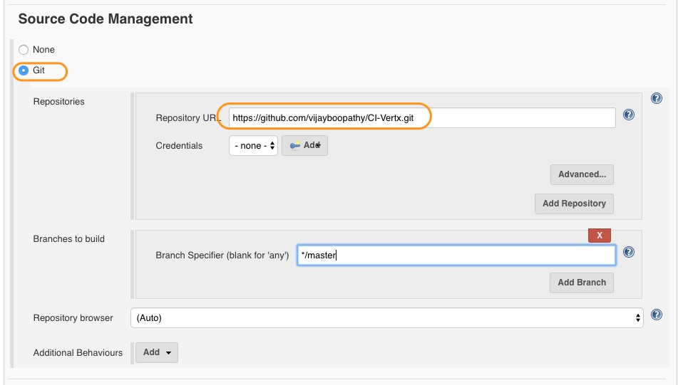
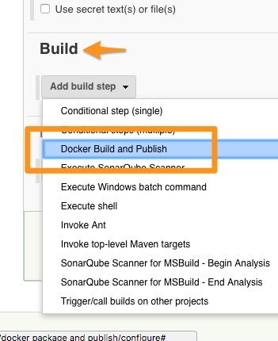

# Create a Docker Image With Our Application

Now our application is ready to be used as a result of successful Package job run. In this chapter, we are going to...

* Copy the artifact from the package job  
* Build a Docker image with our application in it.

## Pre-requisites
(**Note: Visit hub.docker.com and create a DockerHub account if you don't have one already.**)

### Requisite 1

#### Install Copy Artifacts Plugin

* Before creating this job, please install **copy artifacts plugin** which is also a prerequisite.


### Pre Requisite 2 - Set up Docker Environment for Jenkins

* Install CloudBees Docker Build and Publish Plugin


* After installing that plugin, go to `Credentials => global(global domain) => Add credentials => fill in the details


* Now go back to Jenkins Main Page

### Requisite 3

#### Fork the docker repository

* Fork the following repository.

```
https://github.com/initcron/CI-Vertx.git
```

* This repository consists of one **Dockerfile** which you need to update.

* Let us see what this Dockerfile does,

### Requisite 4

#### The Dockerfile

* The Dockerfile is very simple and has only three steps.

```
FROM tomcat:latest
ADD target/CMADSession*.war /usr/local/tomcat/webapps/cmad.war
ADD setenv.sh /usr/local/tomcat/bin/setenv.sh
```

`Line 1`

```
FROM tomcat:latest
```

We are building our image with *official tomcat* image as a **Base image**.

`Line 2`

```
ADD CMADSession*.war.war /usr/local/tomcat/webapps/cmad.war
```

Here we copy our application from the host to container.

`Line 3`

```
ADD setenv.sh /usr/local/tomcat/bin/setenv.sh
```

Like the previous step, we add a script inside the image. The purpose of this script is to decrease the launch time of the application. The script has following contents.


```
# Fast up the server boot process
export JAVA_OPTS="$JAVA_OPTS -Djava.security.egd=file:/dev/./urandom"
```


## Docker-Image Job

* This time create a *freestyle project* named **Docker-Image**.

* In *Source Code Management* step, add the following git repository.

```
https://github.com/initcron/CI-Vertx.git
```

* In *Build Trigger*, add **Package** as a trigger.



* Click on apply project for now.

### Build Environment


This job requires workspace to be cleared before it runs. So,

* In *Build Environment step*, Select **Delete workspace before build starts** then click on **Advanced**.

* In *Patterns for files to be deleted* section, click on **Add**.

* In the second field add **target/*.war** as a pattern.

### Copy the artifact from Package


* In *Build Step*, **Copy artifacts from another project** from the drop down list.

* In *Project name*, Type **Package**.

* Select **Latest successful build** in the next section.

* In *artifacts to copy section*, type **target/*.war**

* This will copy our application from Package job to Docker-Image job.


## Let's Build the Image

* This job has one *Build step*.

* Select **Docker Build and Publish** from the Build step



* Add the following details in the fields.


* Then click on **Save**.

* Now you can **run the Docker-Image job**

If everything goes well, this job will create a Docker image and push it to DockerHub registry.


----
:point_left:[**Prev** Chapter 13: Deploy Application to Tomcat](https://github.com/schoolofdevops/learn-jenkins/blob/master/continuous-delivery/chapters/130_deploy_to_tomcat.md)

:point_right: [**Next** Chapter 15: Deploy application Using Docker Compose ](https://github.com/schoolofdevops/learn-jenkins/blob/master/continuous-delivery/chapters/150_Deploy_with_Docker_compose.md)
