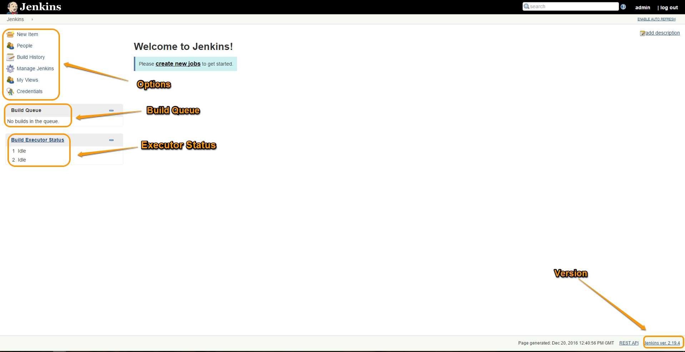
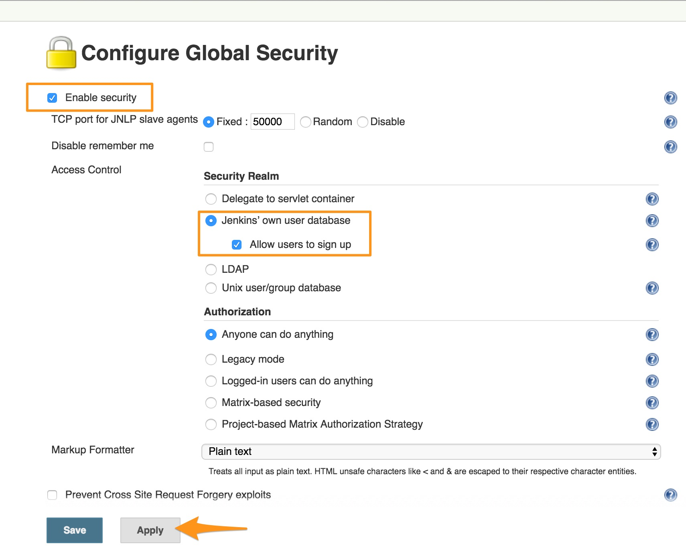
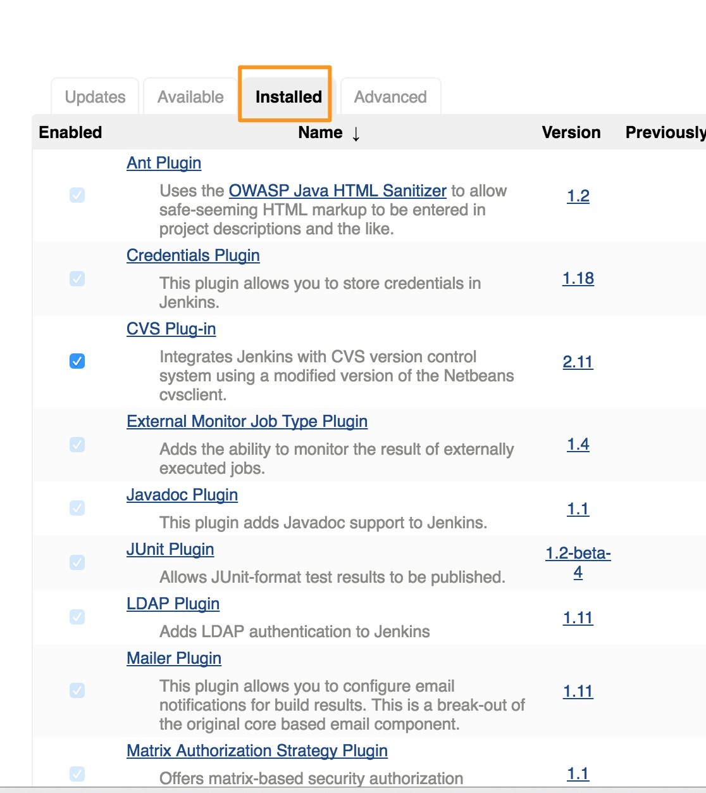
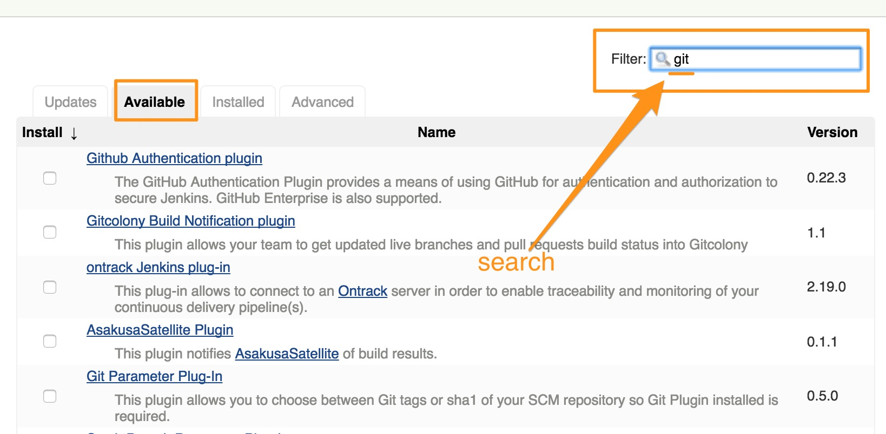

# Jenkins configurations

## Getting Familiar with Jenkins Console
When you login to jenkins for the first time, following is the screen you would see.

* On the left side of the screen, on top is the menu to  create new projects, to manage jenkins, to create users etc.
* Just below the menu is the build queue. All  jobs scheduled to run get added to the queue and would appear here.  
* Below build queue is the build executor status. This shows the status of the jobs being executed in real time.
* Bottom right of the page is the information about jenkins version displayed.

## Configuring Global Security

* Select  Manage Jenkins -> Configure Global Security
* Select checkbox for "Enable Security"
* From Security Realm, select "Jenkins own database"
* Keep "Allow users to sign up" option checked
* Click on **Apply** button

## Sign up and Log in

 * From top right corner, click on "Sign Up"
 * Fill in the form and click on Sign Up button.
 * This will create and account and automatically sign you in.
 * Since the signed up users have complete access to jenkins, you could proceed with rest of the configurations or start creating jobs.

## Plugins

 The real magic of Jenkins lies in its rich plugins eco system. This is how tools integrate with jenkins to build a CI workflow. You want to trigger jenkins jobs after every change going into git, you have a plugin for it. You want to send a notification to your developers on a successful or failed builds, you have a notification plugin. You want to use a tool to fetch or push the build artifacts, you have a plugin for it. This is how most of the tools talk to jenkins.

 In this tutorial, we are going to learn a simple process to install plugins. As part of this, we will end us installing a plugin which would help us integrate jenkins with our git repository.

### Exploring Plugins Configurations
 * From "Manage Jenkins", select  "Manage Plugins" option.  
 * On the Manage Plugins pane you would see the following tabs,
   * Updates
   * Available
   * Installed
   * Advanced
 

 Select "Installed" to view the list of the plugins which came pre installed with jenkins.

 ## Installing Git Plugin
  * From "Manage Plugins", select **Available** tab.
  * On the top-right corner you should see a filter box, start typing the search term in that box. For this example, we would type **git**.

    
  * Scroll down till you see "Git Plugin" in the list, select it and click on "Download and install after restart"
  

  ----
  [Chapter 2: Install Jenkins **Prev**](https://github.com/schoolofdevops/learn-jenkins/blob/master/manuscript/020_install_jenkins.md) :point_left:

  :point_right: [**Next** Chapter 4: Creating First Project with Jenkins](https://github.com/schoolofdevops/learn-jenkins/blob/master/manuscript/040_creating_first_job.md)
