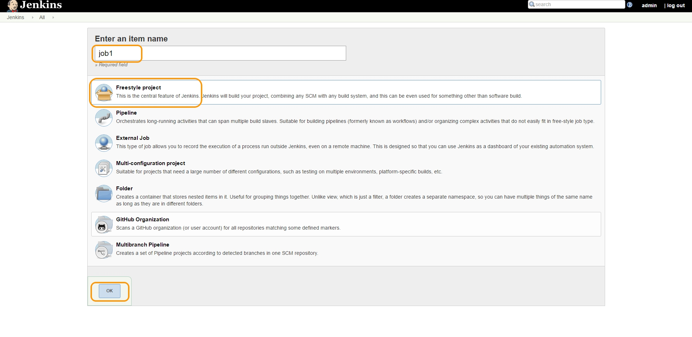
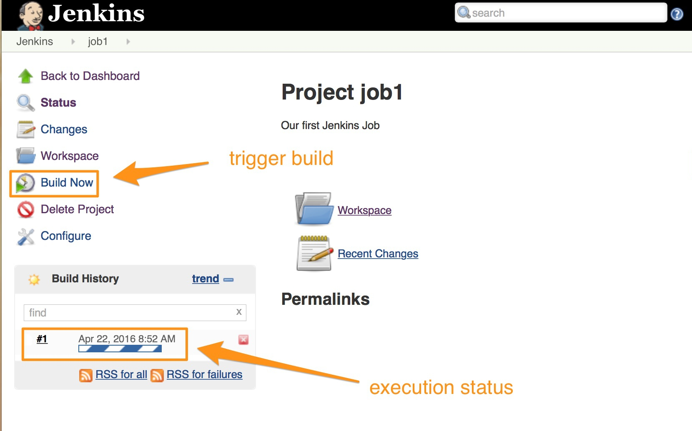
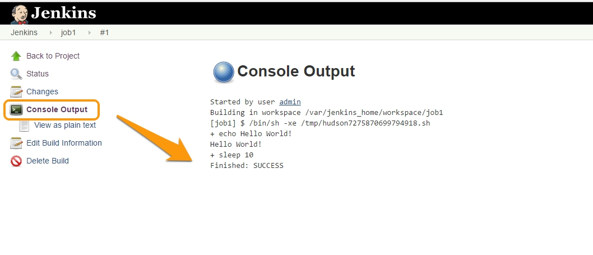

# Chapter 4: Creating First Project
In this session we are going to create and launch our first project  with jenkins. We will be using a free style projct for this example.

## Types of Jobs
With Jenkins you could create following kind of projects or jobs

* Free Style
* Maven
* External Job
* Multi Configuration


## Jenkins Jobs Anatomy
A  typical  style jenkins jobs has the following sections.


* Name/description
* Advanced Option
* Source Code Management
* Build Triggers
* Pre Build
* Build
* Post Build

## Creating a Simple Job
Lets now create a simple job using jenkins to run a hello world program.

1. From Jenkins Main page, click on **New Item**
1. Provide a name to the project in Item Name i.e. "job1". Check against Free Style Project.



Next screen opens the job configuration page. On the job configuration page,
1. Add job description .e.g "Our first Jenkins Job"
1. Skip Source Code Management and Build Triggers, and scroll down to **Build** configurations.
1. From "Add Build Step" select **Execute Shell** and provide commands to execute. Since this  is a  mock job, you could provide following sample code,

```
#!/bin/bash
echo "Hello World !"
sleep 10

```  
Review and click on save to go to project page.



## Building Job for the First Time

Click on **Build Now** to launch a build. Once the build is started, you would see the status in the **Build History** section.

Once build is finished, click on the build number which starts with # . Clicking on the build number e.g. **#1** will take you to the page which shows the build stats. Option of interest on this page might be **Console Status** which shows the run time output.


