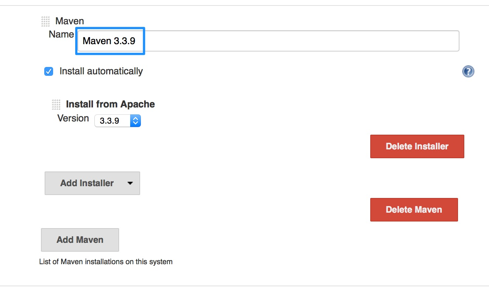

# Chapter 7: Preparing to build Java  Projects

After building a pipeline with mock jobs, we are going to start creating a workflow with a real code. And we will select a java project which gets built with Maven, a java based build tool.  

Running java builds with maven would require additional preparations. Maven should be installed and available on the Jenkins hosts along with the JDK. Lets Install JDK and Maven from the Jenkins dashboard.

## Configure JDK and Maven

To configure JDK and Maven,
* From **Manage Jenkins** select  **Configure System**
* Scroll down to JDK section and click on **JDK Installations**. Provide a name to the instance of java e.g. "Java 7".

* Check the box which mentions "Install Automatically"  
* From "Install from java.sun.com", select the Version of java that you wish to be installed.
* Accept License and click on option to provide Oracle Account credentials.
* You would have to create a Oracle account, add credentials (email/pass) and have the license accepted in order for JDK to be installed on behalf of you by Jenkins.
* Click on **Apply** button to save the configurations and continue with the next configurations on the same screen.

### Configure Maven

Maven configurations are similar to JDK above, its actually simpler than JDK.

To have Maven installed automatically,
* Click on **Maven Installations** from the Jenkins Systems Configurations page.
*  Provide a name to the instance of maven being installed e.g. "Maven 3.3.9"
* Check  "Install automatically" box. Click on save.

Thats it. Maven and JDK will automatically be installed when you create a project with java build.

T> ## JDK and Maven are not immediately Installed
T>
T> after providing these configurations. Jenkins
T>
T> would call the procedures to install these
T>
T> when you create a Job which uses JDK/Maven
