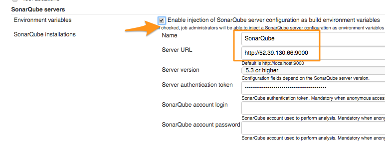
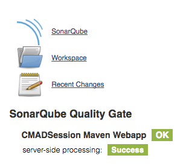

## Static Code Analysis with SonarQube

### Install  Sonarqube Plugin

From Manage Jenkins => Manage Plugins, install SOnarQube plugin from Available tab.


### Generate Token (For SonarQube version 5.3 or higher)

* From SonarQube UI, login using following (default) credentials

user: admin  
pass: admin  


* Click on **Administration** Tab. From **Security** drop down menu, select **Users**.  

* For Administrator User, click on **Tokens**


* From **Generate Tokens** provide a name and click on **Generate**.


Copy over the Token. This should be used for subsequently configuring sonarqube plugin for jenkins. Please note this token is shown only once.

### Configure Sonarqube Plugin
From "Configure System" scroll to **SonarQube servers** and click on "Add SonarQube".

Select the following option

" Enable injection of SonarQube server configuration as build environment variables	"

Provide the details

Name : Sonarqube
Server URL: http://SONAR_IP:9000
Either Token or User/Pass based on your version of SonarQube.

Click on Apply.




### Create A Job to run Sonar Analysis

From **New Items** create a new project. Name it as **SonarQube** and select Freestyle Project.


Review Job Configurations

* Provide Description
* Add Git SCM Repository Configuration  
* Check Resolve Artifacts from Artifactory from Build Environment. Provide the same configurations as build job that we configured earlier to connect with artifactory.
* From Build Triggers, select **Build After Other Projects are Built** and provide dependency on "build".
* From Build Environment , check  **Prepare SonarQube Scanner environment**. If you do not see this option, you will have to go back to system configurations, go to sonarqube server options and check the box which starts with "Enable injection of SonarQube....."
* From **Build**, select **Top Level Maven Targets**. From drop down menu, choose the version of Maven to use. In the Goals, provide following line,

```

$SONAR_MAVEN_GOAL -Dsonar.host.url=$SONAR_HOST_URL

```

Save and Build.  If the job is successful, it should show a status similar to below,



