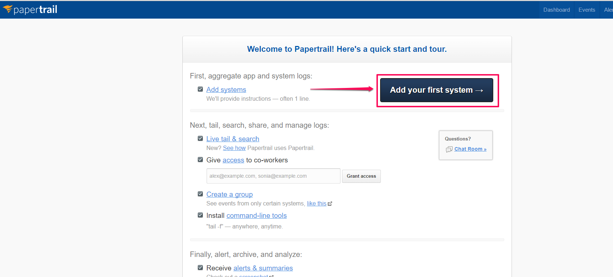
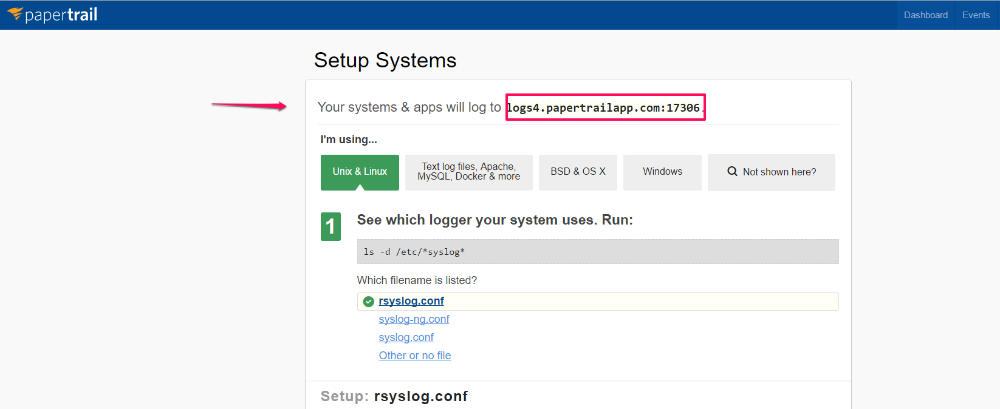
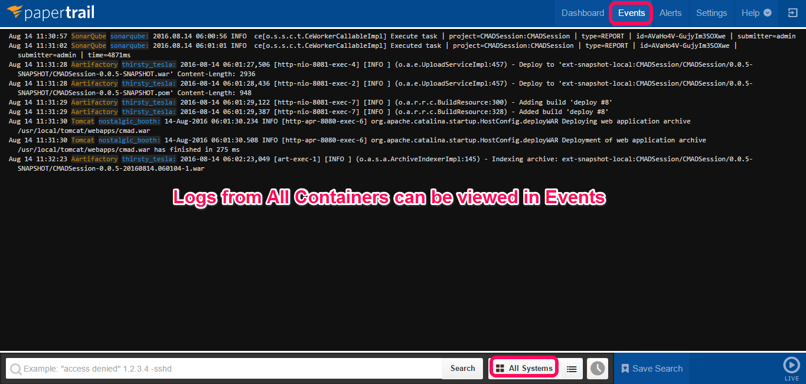
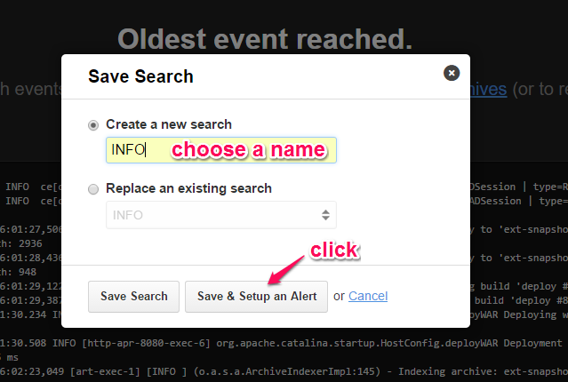
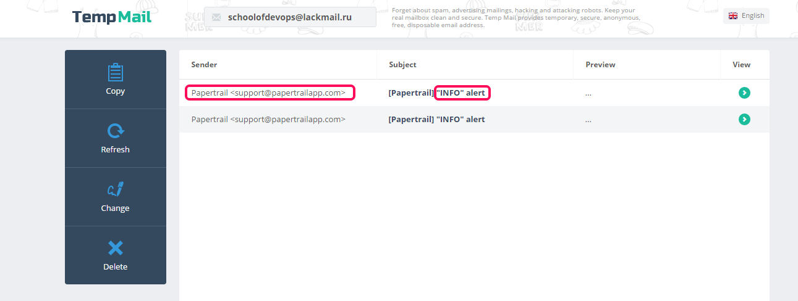
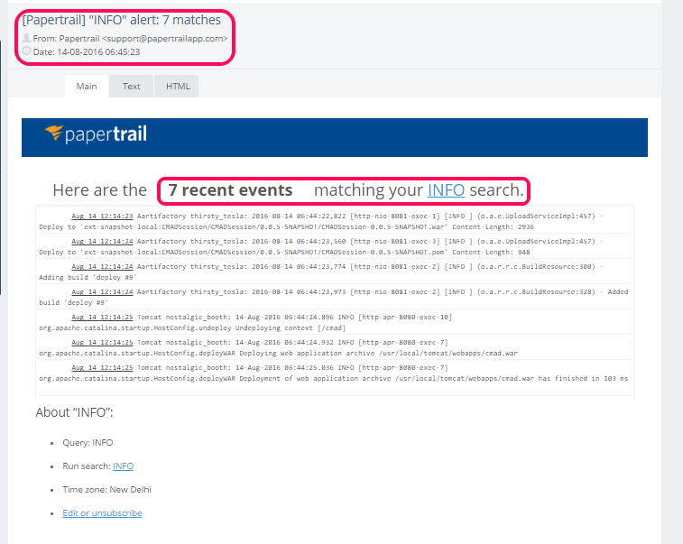

# Monitoring Containers
  In this chapter we are going to monitor logs from container. This can be achieved by using the various monitoring tools, we use

    Papertrail monitoring solution

## Papertrail

* Go to https://papertrailapp.com/signup?plan=free

* Sign up for the service

  

* Once sign up choose `Add a system`

  

* This is the URL to which we will ship the logs. Copy the URL for using in rsyslog configuration

  

  _Note: Url will be different for you_

## Setting up Logspout Container

To send logs from applications running in a Docker container, we use a small container developed by [gliderlabs](https://hub.docker.com/r/gliderlabs/logspout/)

To start a logspout container, run: [Reference](http://help.papertrailapp.com/kb/configuration/configuring-centralized-logging-from-docker/)

    docker run --restart=always -d -p 80:80\
      -v=/var/run/docker.sock:/var/run/docker.sock gliderlabs/logspout  \
      syslog://logs4.papertrailapp.com:10656

Replace `logs4.papertrailapp.com:10656` with one of your Papertrail log destinations.

Now this contaner run in a background with port mapping 80:80.

## Monitoring logs

* Once there is an entry for log in other container starts, Logspout Container helps to collect the logs from various Containers to papertrail automatically.

* Visit `Dashboard` in [papertrail](https://papertrailapp.com/dashboard).

  

* Click `All Systems` from Dashboard to view and edit the setings of various systems _(in our case containers)_.

  

  Change the name of each system with respect to container for easy understanding.

* Click `Events` to monitor logs.

  

## Creating an Alert

* To create an alert based on log, `search` for the entry and `Save Search`.

  

* `Save Search` will open a dialog in which you can choose a name and click `Save and Setup an Alert`

  

* It will redirect to page in which you can choose various forms of alert like mail, hipchat, slack, campfire, etc...

  

* Once the settings are provoided and created an alert, settings are saved and we can Update, delete and modify the search.

  

## Verifying an alert

* We get an alert in mail once the query based on our search is occured.

  

  
