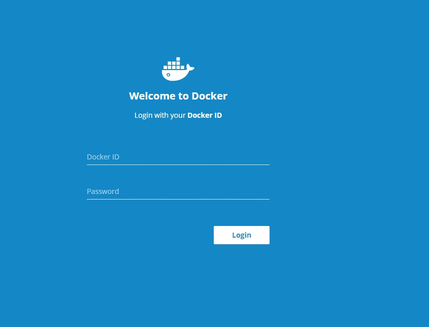

# Create a custom Docker image with our application

## Create the Dockerfile

* Change to Jenkins home directory.
* Generally it would be **/var/lib/jenkins**.
* Create the following [Dockerfile](https://docs.docker.com/engine/reference/builder/) from there.

```
FROM tomcat:latest
ENV CATALINA_HOME /usr/local/tomcat
ENV PATH $CATALINA_HOME/bin:$PATH
WORKDIR $CATALINA_HOME
ADD /workspace/Deploy/target/*.war /usr/local/tomcat/webapps/
EXPOSE 8080
CMD ["catalina.sh", "run"]
```
## Build Docker Image

* Now we will create a Docker Image with our application in it. Now keep in mind that the image name that you are giving using ** -t ** option will be the name of your repository on Docker Hub. (You will learn later in the chapter)

```
docker build -t cmadapp .
```

[Output]

```
Sending build context to Docker daemon   426 MB
Step 1/7 : FROM tomcat:latest
 ---> a2d038e2e14d
Step 2/7 : ENV CATALINA_HOME /usr/local/tomcat
 ---> Running in 0407bb75f241
 ---> 14500ffc5318
Removing intermediate container 0407bb75f241
Step 3/7 : ENV PATH $CATALINA_HOME/bin:$PATH
 ---> Running in 72e46f689c63
 ---> 22ac20c241f3
Removing intermediate container 72e46f689c63
Step 4/7 : WORKDIR $CATALINA_HOME
 ---> af933271beac
Removing intermediate container d39d46e35468
Step 5/7 : ADD /workspace/Deploy/target/*.war /usr/local/tomcat/webapps/
 ---> 04df981a733c
Removing intermediate container fc7423c94372
Step 6/7 : EXPOSE 8080
 ---> Running in 41899b198bc6
 ---> 47ff446ae9bc
Removing intermediate container 41899b198bc6
Step 7/7 : CMD catalina.sh run
 ---> Running in bf415f4271a5
 ---> a326ecfcfc6b
Removing intermediate container bf415f4271a5
Successfully built a326ecfcfc6b
```

* Run *docker images* to see if your image is in your machine or not.

```
REPOSITORY                                TAG                 IMAGE ID            CREATED              SIZE
cmadapp                                   latest              1388cee3acbe       About a minute ago   355 MB
docker.bintray.io/jfrog/artifactory-oss   latest              d7d26a1a4a8e        5 days ago           448 MB
sonarqube                                 5.6.4               5b9898c62a2f        4 days ago           778 MB
```

## Push Your Image

* Go to [Docker Hub](https://hub.docker.com/).

* Sign up if you don't have an account or log in.



* After logging in, you will be presented with the following screen. I already have two repositories created, that's why we see them. In your case, you will not see any repository listed.


* Now we will push this image to Docker Hub.
* Log in to your **Docker Hub** from the machine


* Now in the machine in which you have the custom image, tag the **Image ID** with your **Docker Hub** name

```
docker tag ImageID YourDockerHubId/ImageName:latest
```


* Now to push the image to Docker Hub, run the following command

```
docker push YourDockerHubId/ImageName:latest
```


* After pushing the image, you can see it is listed on your Docker Hub dashboard.


* Now you can pull this image from any machine just like pulling other docker images. Only thing that you have to have in your mind is specifying correct repository name in the pull command.

```
docker pull YourRepoName/YourImageName:
```


-----
:point_left:[**Prev** Chapter 13: Monitoring Containers](https://github.com/schoolofdevops/learn-jenkins/blob/master/manuscript/130_Monitoring_Containers.md)
